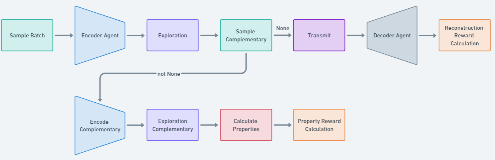

# Embedding Framework

## Pipeline

**Components**
- Sampler
- Encoder
- Explorer
- PropertyCalculator
- Transmitter
- Decoder
- RewardCalculator

**Visualisation**

**Learning Modes**

The DecoderAgent is always trained based on the reconstruction reward.
The Encoder Agent can be trained based on either reconstruction or property reward.